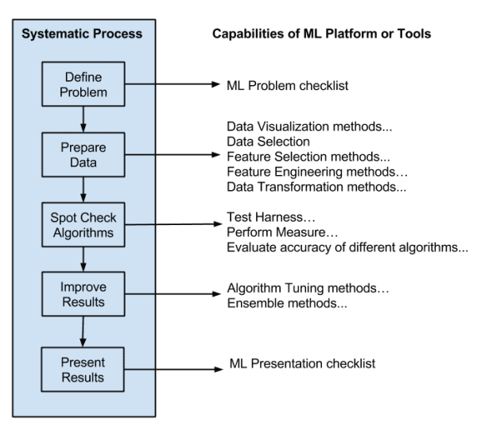

# Applied Machine Learning #
In this course we were presented with a dive into _practical applications_ of *machine learning (ML)* in modern organizations and society. The tentative topic schedule was:
    <ul>
        <li>ML Theory and Methods</li>
        <li>Data Analysis</li>
        <li>Probability & Mathematical Statistics</li>
        <li>Deep Learning</li>
        <li>Probabilistic Graphical Models</li>
        <li>Convex Optimization</li>
        <li>Regression Analysis</li>
        <li>Feature engineering (e.g., basis transforms, selection , Principal Components Analysis)</li>
        <li>Classification versus Regression</li>
        <li>Supervised methods (e.g., Naive Bayes, Decision Trees and Random Forests, Linear & Logistic Regression, Support Vector Machines (SVM), Nearest Neighbours (KNN), and Neural Networks (MLP/ANN/CNN/RNN))</li>
        <li>Unsupervised clustering methods (e.g., k-Means, Gaussian Mixture Models, Hierarchical Clustering)</li>
    </ul>

## What Is Machine Learning? ##

<blockquote>"Neural networks and other forms of machine learning ultimately learn by
trial and error, one improvement at a time" ~ John Pavlus, <a href="https://www.quantamagazine.org/what-is-machine-learning-20240708/">Quanta Magazine (July 8, 2024)]</a>
</blockquote>

 

 

By now, many people think they know what <strong>machine learning</strong> is: You “feed” computers a bunch of “training data” so that they “learn” to do things without our having to specify exactly how. But computers aren’t dogs, data isn’t kibble, and that previous sentence has way too many air quotes. What does that stuff really mean? 

Machine learning is a sub eld of <strong>articial intelligence (AI)</strong>, which explores how to computationally simulate (or surpass) humanlike intelligence. While some AI techniques (such as expert systems) use other approaches, machine learning drives most of the field’s current progress by focusing on one thing: using algorithms to automatically improve the performance of other algorithms.

Here’s how that can work in practice, for a common kind of machine learning called <strong>supervised learning</strong>. The process begins with a task — say, “recognize cats in photos.” The goal is to find a mathematical function that can accomplish the task. This function, which is called <strong>the model</strong>, will take one kind of numbers as input — in this case, digitized photographs — and transform them into more numbers as output, which might represent labels saying “cat” or “not cat.” The model has a basic mathematical form, or shape, that provides some structure for the task, but it’s not likely to produce accurate results at rst. 

Now it’s time to train the model, which is where another kind of algorithm takes over. First, a different mathematical function (called the objective) computes a number representing the current “distance” between the model’s outputs and the desired result. Then, the training algorithm uses the objective’s distance measurement to adjust the shape of the original model. It doesn’t have to “know” anything about what the model represents; it simply nudges parts of the model (called the parameters) in certain mathematical directions that minimize that distance between actual and desired output.

Once these adjustments are made, the process restarts. The updated model transforms inputs from the training examples into (slightly better) outputs, then the objective function indicates yet another (slightly better) adjustment to the model. And so on, back and forth, back and forth. After enough iterations, the trained model should be able to produce accurate outputs for most of its training examples. And here’s the real trick: It should also maintain that performance on new examples of the task, as long as they’re not too dissimilar from the training. 

Using one function to repeatedly nudge another function may sound more like busywork than “machine learning.” But that’s the whole point. Setting this mindless process in motion lets a mathematical approximation of the task emerge automatically, without human beings
having to specify which details matter. With ef cient algorithms, well chosen functions and enough examples, machine learning can create
powerful computational models that do things we have no idea how to program.

Classification and prediction tasks — like identifying cats in photos or spam in emails — usually rely on supervised machine learning, which means the training data is already sorted in advance: The photos containing cats, for example, are labeled “cat.” The training process shapes a function that can map as much of the input onto its corresponding (known) output as possible. After that, the trained model labels unfamiliar examples. 

Unsupervised learning, meanwhile, nds structure within unlabeled examples, clustering them into groups that are not speci ed in advance.
Content-recommendation systems that learn from a user’s past behavior, as well as some object-recognition tasks in computer vision, can rely on unsupervised learning. Some tasks, like the language modeling performed by systems like GPT-4, use clever combinations of supervised and unsupervised techniques known as self- and semi-supervised learning.

Finally, reinforcement learning shapes a function by using a reward signal instead of examples of desired results. By maximizing this reward through trial and error, a model can improve its performance on dynamic, sequential tasks like playing games (like chess and Go) or controlling the behavior of real and virtual agents (like self-driving cars or chatbots). 

To put these approaches into practice, researchers use a variety of exotic-sounding algorithms, from kernel machines to Q-learning. But since the 2010s, artificial neural networks have taken center stage. These algorithms — so named because their basic shape is inspired by the connections between brain cells — have succeeded at many complex tasks once considered impractical. Large language models, which use machine learning to predict the next word (or word fragment) in a string of text, are built with “deep” neural networks with billions or even trillions of parameters.

But even these behemoths, like all machine learning models, are just functions at heart — mathematical shapes. In the right context, they can be extremely powerful tools, but they also have familiar weaknesses. An “overfitted” model ts its training examples so snugly that it can’t reliably generalize, like a cat-recognizing system that fails when a photo is turned upside-down. Biases in data can be ampli ed by the training process, leading to distorted — or even unjust — results. And even when a model does work, it’s not always clear why. (Deep learning algorithms are particularly plagued by this “interpretability” problem.)

Still, the process itself is easy to recognize. Deep down, these machines all learn the same way: back and forth, back and forth.

## Objectives/Outline ##

The image above depicts an overview of modern machine learning, and it is an important distinction to say that it is modern because I also learned the traditional model of ML. In it reinforcement learning is an independent discipline, unsupervised and supervised learning have no intersection point, deep learning (DL) is a proper subset of supervised learning, and ML is a proper subset of AI. So you may want to ask yourself:
<ol>
    <li>Does Deep Learning (DL) intersect with Unsupervised Learning (UL)?</li>
    <li>Does Reinforcement Learning (RL) stand entirely on its own?</li>
</ol>

#### 1. Does DL intersect with UL? ####
Yes. DL achieved its earliest, most famous breakthroughs using supervised learning (like using CNNs on labeled ImageNet data). It has now heavily expanded into unsupervised territory. Generative Models: Tools like GANs (Generative Adversarial Networks) and Variational Autoencoders (VAEs) learn the underlying distribution of unlabeled data to generate new images or text. Self-Supervised Learning (SSL): This is the massive field driving modern Large Language Models (LLMs like GPT) and vision transformers. The model takes completely unlabeled text, hides a part of it, and tries to predict the missing word. It creates its own "labels" from raw data.

The Diagram's Depiction: Notice how the Deep Learning circle (the dark purple core) spans across both Supervised and Unsupervised learning. It even explicitly calls out "Self-supervised/unlabeled DL tasks" on the right side.

#### 2. Does RL stand entirely on its own? ####
No. Historically, RL was studied as an independent branch of machine learning based on trial-and-error reward systems. However, modern breakthroughs happen when RL is combined with other paradigms. Deep Reinforcement Learning (DRL): When an RL agent needs to operate in a complex environment (like playing chess, Go, or driving a car), it uses Deep Learning (Neural Networks) to perceive its environment and make decisions.

The Diagram's Depiction: The orange Reinforcement Learning circle overlaps heavily with the purple Deep Learning circle. Classic examples like AlphaGo or Autonomous Driving (listed right at the intersection) literally could not exist without Deep Learning processing the visual/spatial data while the RL agent decides the strategy.

<small>The informational text above is courtesy of Google's Gemini AI model/chat</small>

### Introduction to Applied Machine Learning ###

Overview of machine learning landscape: it is the science (and art) of programming computers so they can learn from data.

<ul>
<li>Types of learning, key concepts:
                <table>
                    <tr><th> Key Term </th><th> Definition </th>
                    <tr><td> Online Learning </td><td></td></tr>
                    <tr><td> Offline Learning </td><td></td></tr>
                    <tr><td> Batch Learning </td><td></td></tr>
                    <tr><td> Instance-based Learning </td><td></td></tr>
                    <tr><td> Model-based Learning </td><td></td></tr>
                    <tr><td> Supervised Learning </td><td>is the most common and widely used branch of machine learning. An algorithm learns from a labeled dataset, which means every piece of training data you feed the model comes paired with the correct answer key.The goal of the algorithm is to learn the underlying mathematical mapping or relationship between the inputs ($x$) and the outputs ($y$), so that when it is given brand-new, unseen inputs, it can accurately predict the correct labels.</td></tr>
                    <tr><td> Unsupervised Learning </td><td>a branch of ML where an algorithm is fed raw, unlabeled training data. The model is left to its own devices to explore the data, find hidden structures, group similar points together, and extract meaningful patterns all on its own.</td></tr>
                    <tr><td> Semi-supervised Learning </td><td></td></tr>
                    <tr><td> Reinforcement Learning </td><td></td></tr>
                <tr><td> Overfitting (High Variance) </td><td>the model is too complex and has essentially memorized the training data, including its random noise and outliers. It is highly sensitive to small fluctuations (variance).</td></tr>
                <tr><td> Underfitting (High Bias) </td><td>The model is too simple to capture the underlying patterns in the data. It makes strong, erroneous assumptions (bias). Symptoms include; high error on both the training data and the testing data.</td></tr>
                <tr><td> Regularization </td><td></td></tr>
                <tr><td> Hyperparameter </td><td></td></tr>
                <tr><td> Confusion Matrix </td><td></td></tr>
            </table>
</li>
<li>Introduction to machine learning tools and frameworks.
    <ul>
    <li>Core Workflow
        <ol>
        <li>Data Collection: Gather historical data that already contains the answers (e.g., historical stock prices, or thousands of medical scans marked "benign" or "malignant").</li>
        <li>Feature Extraction: Decide which inputs ($x$) the model should look at to make its decision.</li>
        <li>Training: Feed the training portion of the data to the algorithm so it can adjust its weights to minimize its prediction errors.</li>
        <li>Evaluation: Test the trained model on a separate holdout dataset (the test set) using metrics like Accuracy, F1-Score, or RMSE to see how well it generalizes to the real world.</li>
        </ol>
    </li>
    <li>Data Organization:
        <ul>
        <li>Training Set</li>
        <li>Validation Set</li>
        <li>Testing Set</li>
        </ul>
    </li>
    </ul>
</li>
<li>Key concepts in data preprocessing: cleaning, feature engineering, and handling missing values.</li>
<li>Setting up Python-based environments for ML: 
    <ul>
    <li>Jupyter Notebooks,</li>
    <li>Numpy,</li>
    <li>Pandas,</li>
    <li>Matplotlib,</li>
    <li>Scikit-Learn,</li> 
    <li>and TensorFlow.</li>
    </ul>
    </li>
</ul>

### Supervised Learning ###

#### Regression ####
<ul>
<li>Linear Regression: is one of the most fundamental, widely used algorithms in statistics and machine learning. Its primary goal is to predict a continuous numeric value by establishing a straight-line relationship between one or more independent variables (inputs) and a dependent variable (the output). Think of it as finding the "line of best fit" through a scatter plot of data points.</li>
<li>Polynomial Regression: is a form of regression analysis used when the relationship between your independent variable (input) and dependent variable (output) is non-linear (curved). It is essentially an extension of Multiple Linear Regression, but instead of drawing a straight line, it curves the line to fit data points that bend, wave, or change direction.</li> 
<li>Regularization techniques (Ridge, Lasso): when you train a machine learning model (like Linear or Polynomial Regression), it can easily become overfitted—meaning it memorizes the training data, including the random noise, and fails to predict accurately on new, unseen data. Regularization is a technique used to prevent overfitting by adding a penalty to the complex parts of the model, forcing it to keep the model weights (coefficients) small and simple.
    <ul>
    <li>Ridge Regression adds a penalty proportional to the squared magnitude of the coefficients.</li>
    <li>Lasso stands for Least Absolute Shrinkage and Selection Operator. Instead of squaring the coefficients, Lasso adds a penalty proportional to the absolute value of the coefficients.</li>
    </ul>
</li>
<li>Evaluating model performance: once you have built a regression model (whether it is Linear, Polynomial, Ridge, or Lasso), you need to measure how well it actually performs. Mean Squared Error (MSE) and R-squared ($R^2$) are the two most fundamental metrics used to evaluate regression models, but they measure performance in completely different ways.
    <ul>
    <li>Mean Squared Error (MSE): MSE measures the average squared distance between the actual observed values ($y$) and the values predicted by your model ($\hat{y}$). It tells you, on average, how far off your predictions are.</li>
    <li>R-squared: while MSE gives you an absolute error number, it doesn't tell you if that number is relatively "good" or "bad" for your specific dataset. R-squared ($R^2$) solves this by providing a relative score. It measures the proportion of variance in the dependent variable that can be explained by your model's independent variables. Essentially, it answers: How much better is my model compared to a dumb baseline model that just guesses the average value every time?</li>
    </ul>
    <table>
        <tr><th> Feature </th><td> Mean Squared Error (MSE) </td><td> R-squared (R2) </td></tr>
        <tr><th> Type of Metric </th><td> Absolute measure of error. </td><td> Relative measure of fit. </td></tr>
        <tr><th> Units </th><td> Squared units of the target variable. </td><td> Unitless (independent of data scale). </td></tr>
        <tr><th> Ideal Value </th><td> As close to 0 as possible. </td><td> As close to 1 (or 100%) as possible. </td></tr>
        <tr><th> Best Used For </th><td> Comparing different variations of the same model or tracking tuning progress. </td><td> Comparing performance across entirely different datasets or problems. </td></tr>
    </table></li>
</ul>

#### Classification ####
<ul>
    <li>Introduction to classification algorithms: 
        <ul>
            <li>Logistic Regression: is a fundamental statistical and machine learning algorithm used to predict the probability of a binary outcome (a variable that can only have two possible values, like Yes/No, True/False, or 0/1). Despite having "regression" in its name, it is almost exclusively used for classification tasks rather than predicting continuous numbers (like housing prices) </li>
            <li>K-Nearest Neighbors (KNN): this is one of the simplest, most intuitive, and effective algorithms used in machine learning. It is a non-parametric, lazy learning algorithm that can be used for both classification (predicting a category) and regression (predicting a continuous value), though it is most commonly used for classification. The core philosophy of KNN is simple: "Birds of a feather flock together." It assumes that similar data points exist in close proximity to one another. </li>
            <li>Support Vector Machines (SVM): is a powerful and versatile machine learning algorithm used primarily for classification tasks, though it can also handle regression. It's main objective is to find a boundary that separates different classes of data in the cleanest way possible.</li>
        </ul>
    </li>
    <li>Class imbalance: this occurs in classification problems when one class severely outnumbers the other class(es) in the dataset.
The majority class is often called the negative class, while the minority class is called the positive class (which is usually the class you actually care about detecting). For example, if 99% of your dataset consists of normal bank transactions and only 1% is fraudulent, a "dumb" machine learning model can simply guess "Normal" every single time. 
        <ul>
            <li>The Accuracy Paradox: the useless model will achieve an incredible 99% accuracy, despite completely failing to catch a single fraudulent transaction.</li>
            <li>The Bias: Standard machine learning algorithms are designed to maximize overall accuracy. As a result, they will naturally bias themselves toward the majority class and treat the minority class as ignorable noise.</li>
            <li>Techniques to Handle Class Imbalance: to fix for class imbalance, you have to adjust your data, your algorithm, or your evaluation metrics:
                <ol>
                    <li>Data-Level Resampling Techniques: these techniques alter the dataset before feeding it to the model to balance the class proportions.
                        <ul>
                            <li>Random Undersampling: randomly removing samples from the majority class until it matches the size of the minority class. Here, you throw away potentially valuable information.</li>
                            <li>Random Oversampling: randomly duplicating existing samples from the minority class. Here, it can lead to severe overfitting because the model just memorizes the exact same minority data points.</li>
                            <li>Synthetic Minority Over-sampling Technique (SMOTE)): instead of duplicating existing data, SMOTE creates entirely new, synthetic data points that are statistically similar to the original minority class.</li>
                        </ul>
                    </li>
                    <li>Algorithmic-Level Techniques: instead of changing the data, you change how the algorithm learns.
                        <ul>
                            <li>Class Weights (Cost-Sensitive Learning): Most modern algorithms (like Random Forests, SVMs, or Logistic Regression in scikit-learn) have a class_weight parameter. If your ratio is 1:9, you can tell the model that misclassifying a minority point is 9 times more costly than misclassifying a majority point. This forces the hyperplane or decision boundary to respect the minority class.</li>
                            <li>Tree-Based Ensembles: Tree algorithms (like XGBoost or Random Forest) often handle imbalance better than linear models because they can split data into pure regional nodes, though they still require tuning if the imbalance is extreme.</li>
                        </ul>
                    </li>
                    <li>Change Your Metrics (CRITICAL): never use accuracy to judge an imbalanced dataset. Instead, use metrics that focus heavily on the minority class:
                        <ul>
                            <li>Precision: Out of all the points the model predicted as positive, how many were actually positive? (Minimizes False Positives).</li>
                            <li>Recall (Sensitivity): Out of all the actual positive points, how many did the model manage to find? (Minimizes False Negatives).</li>
                            <li>F1-Score: The harmonic mean of Precision and Recall, giving you a balanced view of how the model is performing on the minority class.</li>
                            <li>ROC-AUC: Measures how well the model separates the two classes across various threshold levels.</li>
                        </ul>
                    </li>
                </ol>
            </li>
        </ul>
    </li>
    <li>Note (NB): A common pitfall is the data leakage trap! When using SMOTE or any oversampling technique, you must only apply it to your Training data. If you apply SMOTE to your entire dataset before splitting it into training and testing sets, synthetic data created from the test set will leak into the training set. This will result in fake, artificially inflated performance scores during evaluation.</li>
    <li>Performance metrics: in machine learning, performance metrics are quantitative measurements used to evaluate how well an algorithm is performing. They act as a scorecard for your model, telling you how close the model's predictions are to the actual truth. Choosing the right performance metric is critical because a model that looks perfect under one metric might be completely useless under another. For example, when evaluating classification models, looking at a single number like _overall accuracy_ can be deeply misleading (especially with imbalanced data). To truly understand your model's strengths and weaknesses, you need a suite of metrics built around the Confusion Matrix. As different ML tasks have different goals, performance metrics are divided by the type of problem you are solving.
        <ol>
            <li>Classification Metrics (Predicting Categories): classification models predict labels or categories (e.g., "Spam" vs. "Not Spam", or "Cat" vs. "Dog"). Most classification metrics are derived from a matrix called the Confusion Matrix.
                <ul>
                    <li>Accuracy: this is the percentage of total predictions that the model got exactly right (both positive and negative). It works well only if your dataset is balanced.</li>
                    <li>Precision: this focuses on minimizing false alarms. Out of everything the model guessed was positive, how many were actually correct?</li>
                    <li>Recall (Sensitivity): this focuses on minimizing missed cases. Out of all the actual positive cases out there, how many did the model manage to find?</li>
                    <li>F1-Score: this is the harmonic mean of Precision and Recall. It gives you a single balanced score, making it the go-to metric for imbalanced datasets.</li>
                    <li>ROC-AUC: this measures the model's ability to distinguish between classes across all possible decision thresholds. An AUC of 1.0 means perfect separation.</li>
                </ul>
            </li>
            <li>Regression Metrics (Predicting Continuous Numbers): regression models predict continuous numeric values (e.g., predicting a house price, tomorrow's temperature, or stock market values). Instead of looking at "right or wrong," these metrics measure the size of the error (residual) between the prediction and reality.
                <ul>
                    <li>Mean Absolute Error (MAE): the average of the absolute differences between actual values and predicted values. It treats all errors equally and is highly intuitive (e.g., "On average, our house price predictions are off by $5,000").</li>
                    <li>Mean Squared Error (MSE): The average of the squared differences between predictions and actual values. Because it squares the errors, it severely penalizes large mistakes or outliers.</li>
                    <li>Root Mean Squared Error (RMSE): the square root of MSE. This brings the error metric back into the original units of your target data, making it easier to interpret while keeping the penalty for large errors.</li>
                    <li>R-squared ($R^2$): also known as the coefficient of determination. It measures what percentage of the variance in the data your model explains. It scales from 0 to 1 (or 0% to 100%), allowing you to see how much better your model is than a baseline that just guesses the average value every time.</li>
                </ul>
            </li>
            <li>Unsupervised Metrics (Clustering): in unsupervised learning (like K-Means clustering), there are no "true labels" to compare predictions against. Instead, performance metrics evaluate how cleanly the data has been grouped.
                <ul>
                    <li>Silhouette Score: Measures how close a data point is to its own cluster compared to how far away it is from other clusters. It ranges from -1 to +1. A high score means clusters are dense and well-separated.</li>
                    <li>Inertia (Within-Cluster Sum of Squares): Measures how internally tight the individual clusters are. Lower inertia means data points inside the same cluster are very close to each other.</li>
                    <li>Davies-Bouldin Index: Evaluates the separation between clusters. A lower score signifies better clustering, meaning clusters are tightly packed and far apart from each other.</li>
                </ul>
            </li>
        </ol>
    </li>
    <li>Case study \- classifying customer churn or sentiment analysis: in the real-world business scenarios, companies don't just want to predict if a customer will leave (classification); they also want to look at the text from customer reviews, support tickets, or surveys using Natural Language Processing (NLP) to understand why they are unhappy (sentiment analysis).Here are a few notable instances and open-source implementations of this exact type of case study:
        <ol>
            <li>Kaggle End-to-End Projects: Kaggle hosts real and synthetic datasets where data scientists build portfolios around this hybrid problem. A prominent example is the [Kaggle Customer Churn, Uplift, and Feedback Dataset](https://www.kaggle.com/datasets/harrachimustapha/customer-churn-uplift-and-feedback-dataset). This project explicitly instructs users to apply classification models (like Logistic Regression and tree-based ensembles) alongside NLP techniques to analyze synthetic customer text reviews and predict churn based on sentiment indicators.</li>
            <li>Academic and Industry Research Papers: Organizations regularly publish methodologies detailing how they merge text sentiment with traditional quantitative features (like usage data or billing amounts) to maximize classification metrics like the F1-Score or ROC-AUC. For a deep dive into the research application, you can view [this peer-reviewed study: Churn Prediction with Sentiment Analysis using NLP and Machine Learning Techniques](https://www.ijcaonline.org/archives/volume186/number48/li-2024-ijca-924140.pdf). This case study walks through handling imbalanced customer data using SMOTE, extracting sentiment features, and training classifiers.</li>
        </ol>
    </li>
</ul>

#### Practical Exercise: Financial Well-Being of Small to Medium Enterprise (SME) Businesses ####
In the included code, this is the project folder "00 Financial Well-Being of Small to Medium Enterprise (SME) Businesses". This was a course assignment project. We chose between two baseline models of logistic regression, and decision tree, Then, we implemented one of them. Thereafter, we implemented and compared two ensemble methods on the model Boosting (e.g. XGBoost) and Bagging (e.g. Random Forest). 

In evaluating the project, we compared:
    <ul>
        <li>single models and ensemble models</li>
        <li>bias and variance behaviour</li>
    </ul>

We chose two from among three robustness test to evaluate the model's performance:
    <ol>
        <li>noisy data (add synthetic noise)</li>
        <li>missing values (simulate missing data)</li>
        <li>reduce training data (data scarcity)</li>
    </ol>
Finally, we performed a k-fold cross-validation and analyzed variance in model performance to test the stabilitiy of the model.

### Model Evaluation and Selection ###

<ul>
    <li>Overfitting and underfitting: Bias-Variance tradeoff: before you can evaluate a model, you have to understand the core tension in machine learning: Bias vs. Variance.
        <ul> 
            <li>Underfitting (High Bias)</li>
            <li>Overfitting (High Variance)</li>
            <li>The Tradeoff: as you increase model complexity, bias decreases, but variance increases. The goal of model selection is to find the "sweet spot" that minimizes total error.</li>
        </ul>
    To catch overfitting early, you cannot rely on a single train/test split. If you get lucky or unlucky with how the data is split, your evaluation will be skewed. Cross-Validation (CV) solves this by rotating which data is used for training and which is used for testing.
    </li>
    <li>Cross-validation techniques: 
        <ul>
            <li>K-Fold Cross-Validation
                <ul>
                    <li>The entire dataset is split into $K$ equal-sized chunks (folds).</li>
                    <li>The model trains on $K-1$ folds and tests on the remaining single fold.</li>
                    <li>This process repeats $K$ times, so every single fold gets a turn as the test set exactly once.</li>
                    <li>The final performance score is the average of all $K$ iterations.</li>
                    <li>Standard Choice: Usually, $K=5$ or $K=10$ strikes the best balance between computational time and statistical reliability.</li>
                </ul>
            </li>
            <li>Leave-One-Out (LOO) Cross-Validation: LOO is an extreme version of K-Fold CV where $K$ equals the total number of data points ($n$) in your dataset.
                <ul>
                    <li>For every iteration, the model trains on $n-1$ samples and evaluates itself on exactly one single data point.</li>
                    <li>When to use it: Great for tiny datasets where you cannot afford to waste data on a test split.</li>
                    <li>The Flaw: It is computationally brutal for large datasets because training a model thousands or millions of times is incredibly slow.</li>
                </ul>
            </li>
        </ul>
    </li>
    <li>Hyper parameter tuning: parameters are weights the model learns on its own during training (like the coefficients in linear regression). Hyperparameters are the architectural settings you must set before training begins (like the value of $K$ in KNN, or $\lambda$ in Ridge regression). Tuning means finding the ideal combination of these settings.
        <ul>
            <li>Grid Search: you give the algorithm a specific list of possibilities for each hyperparameter, and it methodically evaluates every single possible combination using cross-validation.
                <ul>
                    <li>Pros: Exhaustive. If the best combination is on your grid, it will find it.</li>
                    <li>Cons: Incredibly slow and inefficient (e.g., testing 5 values for 4 parameters requires $5^4 = 625$ model runs).</li>
                </ul>
            </li>
            <li>Random Search: instead of checking every combination, you define a statistical range for each hyperparameter. The algorithm randomly samples a fixed number of combinations from those distributions.
                <ul>
                    <li>Pros: Way faster than Grid Search and often yields highly comparable (or better) results because it doesn't waste time evaluating slightly different, poor performing configurations.</li>
                </ul>
            </li>
            <li>Bayesian Optimizatio: Grid and Random search are "blind"—they don't look at past results to decide where to search next. Bayesian Optimization builds a secondary probability model that tracks which hyperparameter combinations yield the best performance. It uses this history to intelligently guess and choose the next best settings to test.
                <ul>
                    <li>Pros: Highly efficient; finds optimal settings with significantly fewer iterations.</li>
                </ul>
            </li>
        </ul>
    </li>     
    <li>Model selection and comparison: once you have tuned multiple distinct algorithms (e.g., a tuned SVM vs. a tuned Random Forest vs. a tuned Logistic Regression), you must pick the winner. 
        <ul>
            <li>Best Practices for Fair Comparison: 
                <ol>
                    <li>the Golden Rule (Holdout Set): Never use the data used during Hyperparameter Tuning/Cross-Validation to make your final comparison. You must keep a completely isolated Test Set (Holdout Set) locked away until the very end.</li>
                    <li>Nested Cross-Validation: For rigorous academic or clinical applications, use Nested CV. An inner loop handles hyperparameter tuning, while an outer loop evaluates overall model generalization.</li>
                    <li>Compare Relevant Metrics: Don't just look at accuracy. If you are deploying an algorithm where speed matters (like edge computing on a phone), you might choose a lighter, slightly less accurate Logistic Regression model over a massive, slow SVM model. Consider:
                        <ul>
                            <li>Performance Score (F1, ROC-AUC, RMSE)</li>
                            <li>Training Time vs. Inference (Prediction) Speed</li>
                            <li>Model size and explainability (Can you interpret why it made a choice?)</li>
                        </ul>
                    </li>
                </ol>
            </li>
        </ul>
    </li>
</ul>

### Unsupervised Learning ###

#### Clustering ####

<ul>
    <li>Clustering algorithms: this is the process of partitioning a dataset into groups (clusters) such that data points in the same group are more similar to each other than to those in other groups.
        <ul>
            <li>K-means: partitions data into $K$ distinct, non-overlapping clusters. It places $K$ centroids randomly, assigns each data point to its nearest centroid, recalculates the center of those points to update the centroid position, and repeats until the centroids stop moving. It assumes clusters are spherical and roughly equal in size. You must specify the number of clusters ($K$) upfront (often chosen using the Elbow Method).</li>
            <li>Density-Based Spatial Clustering of Applications with Noise (DBSCAN): instead of calculating distances from centroids, DBSCAN groups points based on how tightly packed they are (density). It identifies "core points" (dense areas), "border points", and completely ignores isolated points. You do not need to specify the number of clusters in advance. It can find clusters of arbitrary, complex shapes (like concentric circles or waves) and is excellent at automatically filtering out outliers/noise.</li>
            <li>Hierarchical clustering: this builds a tree-like hierarchy of clusters. It is usually agglomerative (bottom-up), where every single data point starts as its own mini-cluster, and the algorithm repeatedly merges the two closest clusters together until only one giant cluster remains. The results are visualized using a tree diagram called a Dendrogram, which allows you to look at the chart and visually decide the optimal number of splits after the model runs.</li>
        </ul>
    </li>
    <li>Evaluating clustering models: since there are no "true labels" to run accuracy checks against, unsupervised evaluation metrics assess the geometric quality of the boundaries.
        <ul>
            <li>Silhouette Score: Measures how well-separated the clusters are. For a given point, it evaluates its distance to its own cluster versus its distance to the next nearest cluster. This has a scale between -1 to +1. A score near +1 means points are tightly packed inside their cluster and far from others. A score near 0 means overlapping clusters.</li>
            <li>Davies-Bouldin Index: Measures the ratio of the visual size of the clusters to the distance between them. Lower scores are better. A lower index signifies that the clusters are highly compact internally and widely separated from each other.</li>
        </ul>
    </li>
    <li>Dimensionality reduction: High-dimensional data (datasets with dozens or hundreds of features) suffer from the "curse of dimensionality"—it becomes sparse, hard to cluster, and impossible to visualize. Dimensionality reduction squashes features down to the most important structural components.
        <ul>
            <li>Principal Component Analysis (PCA): a linear technique that rotates and projects data onto new orthogonal axes called Principal Components (PCs). It maximizes the statistical variance of the data along these new lines. It is best used for compressing data to speed up machine learning models while retaining as much original information (variance) as possible.</li>
            <li>t-Distributed Stochastic Neighbor Embedding (t-SNE): a non-linear technique that calculates probabilities of similarity between points in a high-dimensional space, and then tries to map those exact same relative probabilities into a low-dimensional space (usually 2D or 3D). It is best used for data visualization. It preserves local structures exceptionally well, making it easy to visually spot clusters in a 2D scatter plot, but it loses global context and shouldn't be used for raw feature compression.</li>
        </ul>
    </li>
    <li>Case study: Customer segmentation for marketing. That is, a retail business wants to divide its massive customer base into distinct groups to deploy targeted ad campaigns. They have data on age, annual income, browsing frequency, purchase history, and coupon usage.
        <ul>
            <li>The Pipeline: Pre-processing: Because K-means relies on distances, features are scaled so income doesn't overwhelm age.
                <ul>
                    <li>PCA Application: If the dataset has 40 tracking metrics, PCA is used to reduce the components down to 2 or 3 principal features.</li>
                    <li>Clustering: K-means or DBSCAN groups the customers based on these components.</li>
                </ul>
            </li>
            <li>The Outcome: The business identifies 4 distinct segments:
                <ul>
                    <li>Segment 1: High income, low spending (Conservative).</li>
                    <li>Segment 2: Low income, high spending (High Risk).</li>
                    <li>Segment 3: High income, high spending (VIP Target).</li>
                    <li>Segment 4: Low income, low spending (Budget-Conscious)</li>
                </ul>
            </li>
        </ul>
    </li>
</ul>

#### Association Rule Learning ####
This is an unsupervised machine learning technique used to discover interesting relationships, hidden patterns, or frequent connections between variables in massive databases. Unlike clustering, which groups similar objects together, association rule learning focuses on finding rules that dictate when the occurrence of one item implies the occurrence of another.

<ul>
    <li>Market Basket Analysis and Association Rule Mining: the most famous application of association rule learning is **Market Basket Analysis**, which analyzes customer purchasing habits to determine what products are frequently bought together. To find these relationships, the algorithm evaluates transactions using three critical mathematical metrics:
        <ol>
            <li>Support: measures how frequently a specific item or combination of items appears across the entire transactional database. It seeks to answer the question "how popular is the itemset"?
    
        $$\text{Support}(A \to B) = \frac{\text{Transactions containing both A and B}}{\text{Total Transactions}}$$
    
    Interpretation: If a store has 1,000 total transactions and 100 of them contain both bread and butter, the Support for 
    
        $\{\text{Bread} \to \text{Butter}\}$ 
    
    is 10% ($100 / 1000$). High support means the pattern is common.
            </li>
            <li>Confidence: measures how often the rule turns out to be true. It seeks to answer the question "How reliable is the rule?" by calculating the probability that item $B$ is purchased, given that item $A$ has already been purchased.
    
        $$\text{Confidence}(A \to B) = \frac{\text{Transactions containing both A and B}}{\text{Transactions containing A only}}$$
    
    Interpretation: If 200 transactions contain Bread, and 100 of those also contain Butter, the Confidence is 50% ($100 / 200$). This means half the people who bought bread also bought butter.
            </li>
            <li>Lift measures the strength of the rule over random chance. It seeks to answer the question "How strong is the association?" by comparing how much more often $A$ and $B$ occur together than if they were completely independent of each other.
    
        $$\text{Lift}(A \to B) = \frac{\text{Support}(A \to B)}{\text{Support}(A) \times \text{Support}(B)}$$
                <ul>
                    <li> $\text{Lift} = 1$: Items $A$ and $B$ are completely independent. Buying $A$ has no effect on buying $B$.</li>
                    <li> $\text{Lift} > 1$: Items $A$ and $B$ are positively associated. Buying $A$ significantly increases the likelihood of buying $B$. (This is what data scientists look for).</li>
                    <li> $\text{Lift} < 1$: Items $A$ and $B$ are negatively associated (substitutes). Buying $A$ means they are less likely to buy $B$ (e.g., Apple iPhone vs. Samsung Galaxy).</li>
                </ul>
            </li>
        </ol>
    </li>
    <li>Algorithms: searching through millions of transactions to check every single item combination is computationally impossible. These algorithms use smart optimization strategies to prune useless combinations.
        <ul>
            <li>Apriori Algorithm: apriori relies on the downward-closure property: If an itemset is frequent, then all of its subsets must also be frequent. Conversely, if an item like "avocado" is rarely bought, then any combination containing avocado (like avocado + bread + milk) is automatically discarded. It scans the database multiple times, starting with single items, expanding to pairs, triplets, etc., filtering out any combination that falls below a user-defined Minimum Support threshold. It can be slow on massive databases because it has to repeatedly scan the entire transactional history.</li>
            <li>Eclat Algorithm (Equivalence Class Transformation): while Apriori looks at data horizontally (Transaction ID $\to$ List of Items), Eclat transforms the data vertically (Item $\to$ List of Transaction IDs). To find out how often Bread and Butter are bought together, Eclat simply finds the intersection of the transaction IDs for Bread and the transaction IDs for Butter. It is typically much faster than Apriori for smaller or medium datasets because it only needs to scan the database once.</li>
        </ul>
    </li>
    <li>Applications:
        <ul>
            <li>Product Bundling: E-commerce stores package highly associated items together at a slight discount (e.g., selling a camera, a tripod, and an SD card as a single bundle).</li>
            <li>Store Layout Optimization: Physical supermarkets arrange products with high lift metrics close to each other to prompt impulse buys (like putting chips right next to salsa, or famously, diapers near beer).</li>
            <li>Recommendation Systems: Streaming or retail platforms suggest items using an "Item-to-Item" association strategy (e.g., Amazon’s "Frequently Bought Together" section).</li>
        </ul>
    </li>
    <li>Practical exercise: Building a simple recommendation engine.</li>

### Deep Learning Fundamentals ###

<ul>
    <li>Introduction to neural networks: Perceptron, Multi-layer Perceptron (MLP).</li>
    <li>Activation functions: ReLU, Sigmoid, Tanh.</li>
    <li>Backpropagation and gradient descent.</li>
</ul>

#### Hands-on: Building and training a basic neural network using TensorFlow/Keras. ####

### Convolutional Neural Networks (CNNs) ###

<ul>
    <li>Understanding CNNs and their applications in computer vision. </li>
    <li>Layers in CNN: Convolutional layers, Pooling layers, Fully connected layers. </li>
    <li>Practical application: Image classification using CNN. </li>
    <li>Implementing a CNN in TensorFlow/Keras.</li>
</ul>

### Recurrent Neural Networks (RNNs) ###

<ul>
    <li>RNNs and their applications in sequence modeling (e.g., time series, NLP).</li> 
    <li>Long Short-Term Memory (LSTM) networks and GRU (Gated Recurrent Unit).</li>
    <li>Applications in text generation, machine translation, and stock prediction.</li>
    <li>Hands-on: Building a text prediction model with LSTMs.</li>

### Model Deployment and Optimization ###

<ul>
    <li>Model deployment strategies: Batch processing vs. real-time.</li>
    <li>Introduction to cloud platforms: AWS, Google Cloud, Azure.</li>
    <li>Optimizing models for production environments (e.g., using TensorFlow Lite).</li>
    <li>Case study: Deploying a machine learning model to the cloud.</li>
</ul>

### Ethical Considerations and Fairness in ML ###

<ul>
    <li>Understanding bias and fairness in machine learning.</li>
    <li>Ethics in AI: Transparency, accountability, and interpretability.</li>
    <li>Fairness-aware machine learning algorithms.</li>
    <li>Real-world examples and discussions on the ethical implications of ML in various industries.</li>
</ul>

## Machine Learning Project Checklist ##

<blockquote>How do you get accurate results using machine learning (ML) problem after problem? The <strong>challenge</strong> is that each problem is unique, requiring different data sources, features, algorithms, algorithm configurations and so on. The <strong>solution</strong> is to use a checklist that guarantees a good result every time. ~  <a href="https://machinelearningmastery.com/machine-learning-checklist/">Jason Brownlee, MachineLearningMastery</a></blockquote>

### Each Data Problem is Different ###
You have no idea what algorithm will work best on a problem before you start. Even expert data scientists cannot tell you. This problem is not limited to the selection of machine learning algorithms. You cannot know what data transforms and what features in the data that if exposed would best present the structure of the problem to the algorithms. You may have some ideas. You may also have some favorite techniques. But how do you know that the techniques that got you results last time will get you good results this time?

How do you know that the techniques are transferable from one problem to another? Heuristics are a good starting point (random forest does well on most problems), but they are just that. A starting point, not the end.

### Don’t Start From Zero On Every Problem ###
You do not need to start from scratch on every problem. Just like you can use a machine learning tool or library to leverage best practice implementations of machine learning, you should leverage best practices in working through a problem. The alternative is that you have to make it up each time you encounter a new problem. The result is that you forget or skip key steps. You take longer than is needed, you get results that are less accurate and you probably have less fun.

How are you supposed to know that you’ve finished working through a machine learning problem unless you have defined the solution and it’s intended use right up front?

### How To Get Accurate Results Reliably ###
You can get accurate results reliably on your machine learning problems. Firstly, it’s an empirical question. What algorithm? What attributes? You have to think up possibilities and try them out. You have to experiment to find answers to these questions. Treat each dataset like a search problem. Find a combination that gives good results. The amount of time you spend searching will be related to how good the results are. But there is an inflection point where you switch from making large gains to diminishing returns.

Put another way, the selection of data preparation, data transforms, model selection, model tuning, ensemlbing and so on is a combinatorial problem. There are many combinations that work, there are even many combinations that are good enough. Often you don’t need the very best solution. In fact the very best solution may be what you don’t want. It can be expensive to find, it can be fragile to perturbations in the data and it may very likely be a product of over fitting.

You want a good solution, that is good enough for the specific needs of the problem that you are working on. Often a good enough solution is fast, cheap and robust. It’s an easier problem to solve. Also, if you think you need the very best solution, you can use a good enough solution as your first checkpoint. This simple reframing from “most accurate” to “accurate enough” result is how you can guarantee to get good results on each machine learning problem that you work on.

### You Need a Machine Learning Checklist ###
You can use a checklist to structure your search for the right combination of elements to reliably deliver a good solution to any machine learning problem. A checklist is a simple tool that guarantees an outcome. They’re used all the time in empirical domains where the knowledge is hard won and a guaranteed outcome is very desirable.

For example in aviation like taking off and the use of a pre-flight checklist. Also in medicine with surgical checklists and other fields such as safety compliance. If a result is important, why make up a process every time. Follow a well defined set of steps to a solution.

### Benefits of a Machine Learning Checklist ###
The 5 benefits of using a checklist to work through machine learning problems are:
<ul>
    <li>Less Work: You don’t have to think up all of the techniques to try on each new problem.</li>
    <li>Better Results: By following all of the steps you are guaranteed to get a good result, probably a better result than average. In fact, it ensures you get any result at all. Many projects fail for many reasons.</li>
    <li>Starting Point For Improvement: You can use it as a starting point and add to it as you think of more things to try. And you always do.</li>
    <li>Future Projects Benefit: All of your future projects will benefit from improvements made to the process.</li>
    <li>Customizable Process: You can design the best checklist for your tools, problem types and preferences.</li>
    <li>Machine learning algorithms are very powerful, but treat them like a commodity. The specific one that you use matters a lot less if all you’re interested in is accuracy.</li>
</ul>

In fact, each element of the process becomes a commodity and the idea of favorite methods starts to fade away. I think this is a mature position for problem solving. I think it is probably not appropriate for some endeavors, like academic research. The academic is deeply invested in a specific algorithm. The practitioner sees algorithms only as a means to an end, the predictions or the predictive model.

### Applied Machine Learning Checklist ###
This example checklist is highly constrained for brevity. In fact, think of it is a demonstration or proof of principle than the one true checklist for all machine learning problems – which it intentionally is not. I have constrained this checklist for classification problems working on tabular data.

Also, to keep it digestible, I have kept the level of abstraction reasonably high and limited most sections to three dot points. Sometimes that is not enough, so I have given specific examples of data transforms and algorithms to try in some parts of the checklist, referred to as interludes.

<ol>
<li>Define The Problem
It is important to have a well developed understanding of the problem before touching any data or algorithms. This will give you the tools to interpret results and the vision for what form the solution will take.

You can dive a little deeper into this part of the checklist in the post “How to Define Your Machine Learning Problem“.

1.1 What is the problem?
This section is intended to capture a clear statement of the problem, as well as any expectations that may have been set and biases that may exist.

Define the problem informally and formally.
List the assumptions about the problem (e.g. about the data).
List known problems similar to your problem.
1.2 Why does the problem need to be solved?
This section is intended to capture the motivation for solving the problem and force up-front thinking about the expected outcome.

Describe the motivation for solving the problem.
Describe the benefits of the solution (model or the predictions).
Describe how the solution will be used.
1.3 How could the problem be solved manually?
This section is intended to flush out any remaining domain knowledge and help you gauge whether a machine learning solution is really required.

Describe how the problem is currently solved (if at all).
Describe how a subject matter expert would make manual predictions.
Describe how a programmer might hand code a classifier.
</li><li>Prepare The Data
Understanding your data is where you should spend most of your time.

The better you understand your data, the better job that you can do to expose its inherent structure to the algorithms to learn.

Dive deeper into this part of the checklist in the posts “How to Prepare Data For Machine Learning” and “Quick and Dirty Data Analysis for your Machine Learning Problem“.

2.1 Data Description
This section is intended to force you to think about all of the data that is and is not available.

Describe the extent of the data that is available.
Describe data that is not available but is desirable.
Describe the data that is available that you don’t need.
2.2 Data Preprocessing
This section is intended to organize the raw data into a form that you can work with in your modeling tools.

Format data so that it is in a form that you can work with.
Clean the data so that it is uniform and consistent.
Sample the data in order to best trade-off redundancy and problem fidelity.
Interlude: Shortlist of Data Sampling
There might be a lot to unpack in the final check on sampling.

There are two important concerns here:

Sample instances: Create a sample of the data that is both representative of the various attribute densities and small enough that you can build and evaluate models quickly. Often it’s not one sample, but many. For example, one for sub-minute model evaluation, one for sub-hour, one for sub-day and so on. More data can change the performance of algorithms.
Sample attributes: Select attributes that best expose the structures in the data to the models. Different models have different requirements, really different preferences because sometimes breaking the “requirements” gives better results.
Below are some ideas for different approaches that you can use to sample your data. Don’t choose, use each one in turn and let the results from your test harness tell you which representation to use.

Random or stratified samples
Rebalance instances by class (more on rebalancing methods)
Remove outliers (more on outlier methods)
Remove highly correlated attributes
Apply dimensionality reduction methods (principle components or t-SNE)
2.3 Data Transformation
This section is intended to create multiple views on the data in order to expose more of the problem structure in the data to modeling algorithms in later steps.

Create linear and non-linear transformations of all attributes
Decompose complex attributes into their constituent parts.
Aggregate denormalized attributes into higher-order quantities.
Interlude: Shortlist of Data Transformations
There is an limited number of data transforms that you can use. There are also old favorites that you can use as a starting point to help tease out whether it is worth exploring specific avenues.

Below is a list of some univariate (single attribute) data transforms you could use.

Square and Cube
Square root
Standardize (e.g. 0 mean and unit variance)
Normalize (e.g. rescale to 0-1)
Descritize (e.g. convert a real to categorical)
Which ones should you use? All of them in turn, again, let the results from your test harness inform you as to the best transformations for your problem.

2.4 Data Summarization
This section is intended to flush out any obvious relationships in the data.

Create univariate plots of each attribute.
Create bivariate plots of each attribute with every other attribute.
Create bivariate plots of each attribute with the class variable
</li><li>Spot Check Algorithms
Now it is time to start building and evaluating models.

To dive deeper into this part of the checklist, see the posts “How to Evaluate Machine Learning Algorithms” and “Why you should be Spot-Checking Algorithms on your Machine Learning Problems“.

3.1 Create Test Harness
This section is intended to help you define a robust method for model evaluation that can reliably be used to compare results.

Create a hold-out validation dataset for use later.
Evaluate and select an appropriate test option.
Select one (or a small set) performance measure used to evaluate models.
3.2 Evaluate Candidate Algorithms
This section is intended to flush quickly out how learnable the problem might be and which algorithms and views on the data may be good for further investigation in the next step.

Select a diverse set of algorithms to evaluate (10-20).
Use common or standard algorithm parameter configurations.
Evaluate each algorithm on each prepared view of the data.
Interlude: Shortlist Algorithms To Try on Classification Problems
Frankly, the list does not matter as much as the strategy of spot checking and not going with your favorite algorithm.

Nevertheless, if you’re working a classification problem throw in a good mix of algorithms that model the problem quite differently. For example:

Instance-based like k-Nearest Neighbors and Learning Vector Quantization
Simpler methods like Naive Bayes, Logistic Regression and Linear Discriminant Analysis
Decision Trees like CART and C4.5/C5.0
Complex non-linear approaches like Backpropagation and Support Vector Machines
Always throw in random forest and gradient boosted machines
To get ideas on algorithm to try, see the post “Tour of Machine Learning Algorithms”
</li>
<li>Improve Results
At this point, you will have a smaller pool of models that are known to be effective on the problem. Now it is time to improve the results.

You can dive deeper into this part of the checklist in the post “How to Improve Machine Learning Results“.

4.1 Algorithm Tuning
This section is intended to get the most from well performing models.

Use historically effective model parameters.
Search the space of model parameters.
Optimize well performing model parameters.
4.2 Ensemble Methods
This section is intended to combine the results from well performing models and give a further bump in accuracy.

Use Bagging on well performing models.
Use Boosting on well performing models.
Blend the results of well performing models.
4.3 Model Selection
This section is intended ensure the process of model selection is well considered.

Select a diverse subset (5-10) of well performing models or model configurations.
Evaluate well performing models on a hold out validation dataset.
Select a small pool (1-3) of well performing models.
</li><li>Finalize Project
We now have results, look back to the problem definition and remind yourself how to make good use of them.

You can dive deeper into this part of the checklist in the post “How to Use Machine Learning Results“.

5.1 Present Results
This section is intended to ensure you capture what you did and learned so that others (and your future self) can make best use of it

Write up project in a short report (1-5 pages).
Convert write-up to a slide deck to share findings with others.
Share code and results with interested parties.
5.2 Operationalize Results
This section is intended to ensure that you deliver on the solution promise made up front.

Adapt the discovered procedure from raw data to result to an operational setting.
Deliver and make use of the predictions.
Deliver and make use of the predictive model.
</li></ol>

### Tips For Getting The Most From This Checklist ###
I think this checklist, that if followed, is a very powerful tool.

In this section I give you a few additional tips that you can use to get the most out of using the checklist on your own problems.

<ol>
<li>Simplify the Process. Do not do everything on your first try. Pick two algorithms to spot check, one data transformation, one method of improving results, and so on. Get through one cycle of the checklist, then later start adding on the complexity.
</li><li>Use Version Control. You will be creating a lot of models and a lot of scripts (if you’re using R or Python). Ensure you do not lose a good result by using version control (like GitHub).
</li><li>Proceduralize. No result, no transform and no visualization is special. Everything should be created procedurally. This may be a process that you write down if you’re using Weka, or it may be Makefiles if you are using R or Python. You will find bugs in your stuff and you will want to be able to regenerate probably all of your results at the drop of a hat. If it’s all proceduralized from the beginning, this is as simple as typing “make“.
</li><li>Record All Results. I think it’s good practice for every algorithm run to save predictions in a file. Also to save each data transform and sample in a separate file. You can always run new analysis on the data if it is sitting in a file in a directory as part of your project. This matters a lot more if a result took hours, days or weeks to achieve. This includes cross-validation predictions that can be useful in more complex blending strategies.
</li><li>Don’t Skip Steps. You can cut a step back to the minimum, but don’t skip any step, even if you think you know it all. The idea of the checklist is to guarantee an outcome. Doctors are very smart and very qualified, but they still need to be reminded to wash their hands. Sometimes you can simply forget a key step in the process that is absolutely key (like defining your problem and realizing you don’t even need machine learning).
</li></ol>

### I’m Skeptical, Can This Really Work? ###
It’s just a checklist, not a silver bullet.

You still need to put in the work. You still need to learn about the algorithms and data manipulation methods to get the most from them. You still need to learn about your tools and how to get the most from them.

Try it for yourself.
Prove to yourself that it’s possible to work through a problem end-to-end. Do it in an hour.

Pick a dataset.
Use Weka (to avoid any programming).
Use the process.
Once you get that first result you will see how easy it is and why it’s so important to spend a lot of time up front on the problem definition, on the data preparation and presenting the solution at the backend of the process.

This approach will not get you the very best results.
This checklist delivers good results, reliably, consistently across problems.

You are not going to win Kaggle competitions with one pass through this checklist, bit you will get a result that you can submit and probably sit above 50% of the leaderboard (often much higher).

You can use it to get great results, but it’s a matter of how much time you want to invest.

The checklist is for classification problems on tabular data.
I chose to demonstrate this checklist with classification problems on tabular data.

That does not mean that it is limited to classification problems. You can readily adapt it to other problem types (like regression) and other data types (like images and text).

I have used variations of this checklist on both in the past.

The checklist does not cover technique “XYZ“.
The beauty of the checklist is the simplicity of the idea.

If you don’t like the steps I’ve laid out, replace them with your own. Add in all the techniques you like to use. Build your own checklist!

If you do, I’d love to see a copy.

There’s a lot of redundancy in this approach.
I view working through a machine learning problem as a balance between exploitation and exploration.

You want to exploit everything you know about machine learning, about the data and about the domain. Add those elements into your process for a given problem.

But don’t exclude the exploration. You need to try stuff that you biases suggest will not be the best. Because sometimes, more often than not, your biases are no good. It’s the nature of data and machine learning.

Why not just code-up the pipeline?
Why not! Maybe you should if you’re a systems guy.

I have myself many times with many different tool chains and platforms. It is very hard to find the right level of flexibility in a coded system. There always seems to be a method or a tool that does not fit in neatly.

I suspect many Machine Learning As A Service (MLaaS) create a pipeline much like the above checklist to ensure good results.

I will get good results without knowing why.
This can happen when you’re a beginner.

You can and should dive a little deeper into the final combination of data preparation and modeling algorithms. You should provide all of your procedure with your result so that anyone else can replicate it (say publicly or within your organization if it is a work project).

Good results can standalone if the way they are delivered is reproducible and the evaluation rigorous. The checklist above provides these features if executed well.

Action Step
Use the checklist to complete a project and build some confidence.

Pick a problem that you can complete in 1-to-2 hours.
Use the checklist and get a result.
Share your first project (in the comments).</blockquote>

## Resources ##

* [Colab Primer](https://colab.research.google.com/github/google/picatrix/blob/main/notebooks/Quick_Primer_on_Colab_Jupyter.ipynb)
* [Mount from Google Drive](https://colab.research.google.com/notebooks/snippets/accessing_files.ipynb#scrollTo=s6nDq8Nk7aPN)
* [Python/Numpy Review](https://colab.research.google.com/github/cs231n/cs231n.github.io/blob/master/python-colab.ipynb)
* [Advanced Python Tutorial](https://colab.research.google.com/drive/1gCqFEquqNvEoTDX3SNhR2PZkXWPHKXnc?usp=sharing)
* [Pandas Data Frame](https://colab.research.google.com/github/google/eng-edu/blob/main/ml/cc/exercises/pandas_dataframe_ultraquick_tutorial.ipynb)
* [Google Colab Charts](https://colab.research.google.com/notebooks/charts.ipynb)
* [Learning Data Science (LDS)](https://github.com/phume03/LDS-textbook)
  * [Alternative link to LDS](https://learningds.org/)
* [Advanced Python Working with Data Git Repo](https://github.com/LinkedInLearning/advanced-python-working-with-data-4312001)
  * [LinkedIn Learning Course](https://www.linkedin.com/learning/advanced-python-working-with-data)
* [Data Science for Beginners](https://github.com/phume03/Data-Science-For-Beginners)
* [Hands-on Machine Learning with Scikit-Learn, Keras & TensorFlow](#)
* OECD Member States:
  * [UN Data on Human Development Index](https://hdr.undp.org/data-center/human-development-index#/indicies/HDI)
  * [List of OECD Member states](https://www.cbs.nl/en-gb/news/2024/42/netherlands-lags-behind-other-oecd-countries-on-labour-productivity-gains/oecd-countries)
* Ensemble Learning Techniques
  * [Ensemble Learning IBM Definition](https://www.ibm.com/think/topics/ensemble-learning)
  * [Guide to Ensemble Learning | Geeks for Geeks](https://www.geeksforgeeks.org/machine-learning/a-comprehensive-guide-to-ensemble-learning/)
  * [Guide to Ensemble Learning | Sci-kit Learn](https://scikit-learn.org/stable/modules/ensemble.html)
  * [Advanced Ensemble Techniques](https://colab.research.google.com/github/sushily1997/Machine_Learning/blob/main/ML_15_Advanced_Ensemble_Techniques(Stacking).ipynb/)

* [Data.org Financial Health Prediction Challenge | Zindi.Africa](https://zindi.africa/competitions/dataorg-financial-health-prediction-challenge)
* [F1 Score in Machine Learning | GeeksforGeeks](https://www.geeksforgeeks.org/machine-learning/f1-score-in-machine-learning/)
* [Precision and Recall in Machine Learning | GeeksforGeeks](https://www.geeksforgeeks.org/machine-learning/precision-and-recall-in-machine-learning/)
* [XGBoost | GeeksforGeeks](https://www.geeksforgeeks.org/machine-learning/xgboost/)
* [XGBoost Multiclass Classification | GeeksforGeeks](https://www.geeksforgeeks.org/machine-learning/xgboost-multiclass-classification/)
* [Decision Tree in Machine Learning | GeeksforGeeks](https://www.geeksforgeeks.org/machine-learning/decision-tree-introduction-example/)
* [Logistic Regression in Machine Learning | GeeksforGeeks](https://www.geeksforgeeks.org/machine-learning/understanding-logistic-regression/)
* [LightGBM (Light Gradient Boosting Machine) | GeeksforGeeks](https://www.geeksforgeeks.org/machine-learning/lightgbm-light-gradient-boosting-machine/)
* [Logistic Regression in Machine Learning | GeeksforGeeks](https://www.geeksforgeeks.org/machine-learning/understanding-logistic-regression/)
* [Ensemble Learning | GeeksforGeeks](https://www.geeksforgeeks.org/machine-learning/types-of-ensemble-learning/)
* [Guide to Ensemble Learning | GeeksforGeeks](https://www.geeksforgeeks.org/machine-learning/a-comprehensive-guide-to-ensemble-learning/)
* ITU UN. Human Development Index (HDI). UNDP, 2026. Web. 2 May 2026
* [What is Ensemble Learning?](https://www.ibm.com/think/topics/ensemble-learning)
* [Scikit Learn. Ensembles: Gradient boosting, random forests, bagging, voting, stacking](https://scikit-learn.org/stable/modules/ensemble.html)
* [OECD countries](https://www.oecd.org/en/countries.html)
* [Hands-On Machine Learning with Scikit-Learn, Kera, and TensorFlow](https://archive.org/details/handsonmachinele0000gron)
* [Huawei AI Academy Training Materials: Machine Learning](https://www.scribd.com/document/558545481/03-Machine-Learning)
* [Huawei AI Academy Training Material: Deep Learning](https://www.scribd.com/document/510580299/Deep-Learning)
* [Huawei AI Academy Training Materials. Python Basics](https://www.studocu.com/row/document/jamaaة-kfr-alshykh/artificial-intelligence/2-chapter-7-python-programming-basics-experimental-guide/21954723)
* [Learning Data Science: Data Wrangling, Exploration, Visualization, and Modeling with Python](https://learningds.org/intro.html)
* [Deep Learning](https://www.deeplearningbook.org)